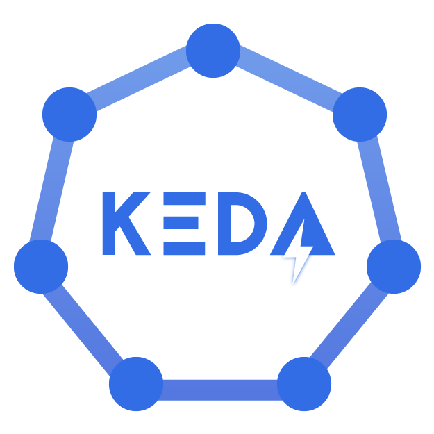

# Hier komt de titel van je blog

*[Osama Halabi, oktober 2024.](https://github.com/hanaim-devops/devops-blog-oshalabi)*

Installeer de aangeraden [mdlint](https://github.com/DavidAnson/markdownlint). Voeg je eerste plaatje en bronnen in.