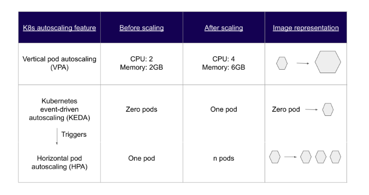
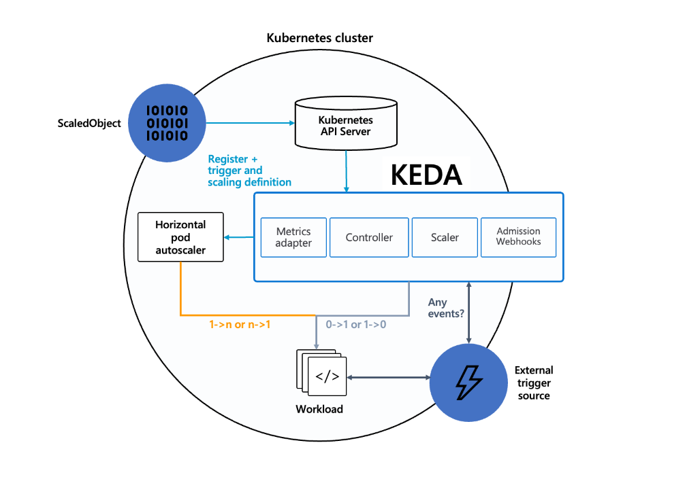
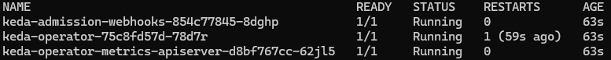

# KEDA in Actie: Event-Driven Autoscaling voor Microservices binnen DevOps


*[Osama Halabi, oktober 2024.](https://github.com/hanaim-devops/devops-blog-oshalabi)*
<hr/>

In de wereld van DevOps en microservices is schaalbaarheid een belangrijk thema. Met de opkomst van Kubernetes als platform voor het beheren van containergebaseerde applicaties, zijn er verschillende manieren ontstaan om applicaties automatisch te schalen. In dit blog wil ik ingaan op KEDA (Kubernetes Event-Driven Autoscaling), een tool die het mogelijk maakt om applicaties te schalen op basis van externe events. Ik schrijf dit blog om inzicht te krijgen in wat KEDA is, hoe KEDA werkt, wat de voordelen en nadelen zijn, en hoe ik het kan toepassen in een microservice-omgeving zoals Pitstop. Daarnaast wil ik met deze blogpost anderen inspireren om KEDA te overwegen als een oplossing voor schaalproblemen in hun eigen DevOps-omgevingen.

## Wat is KEDA

**KEDA,** oftewel [Kubernetes](https://kubernetes.io/) Event-Driven Autoscaling, is een open-source component dat dynamische autoscaling mogelijk maakt voor Kubernetes-applicaties. In tegenstelling tot de standaard autoscaling van Kubernetes, die vaak is gebaseerd op CPU- of geheugenbelasting, stelt KEDA applicaties in staat om te schalen op basis van externe events. Dit betekent dat ik een microservice kun laten schalen op basis van het aantal events die verwerkt moeten worden. Bijvoorbeeld: Op basis van het aantalberichten in een RabbitMQ-wachtrij.

**KEDA** is eingelijk een lichtgewicht component dat een DevOps-team kan toeveogen aan Kubernetes-cluster. Daarnaast werkt KEDA samen met de standaard Kubernetes-componenten zoals de [HPA(Horizontal Pod Autoscaler)](https://kubernetes.io/docs/tasks/run-application/horizontal-pod-autoscale/) en kan functionaliteit uitbreiden zonder te overschrijven of dupliceren.

**KEDA** is gebouwd op Kubernetes [HPA](https://kubernetes.io/docs/tasks/run-application/horizontal-pod-autoscale/) en schaalt pods op basis van informatie uit event sources zoals AWS SQS, Kafka, RabbitMQ, etc. Deze event worden bewaakt met scalers, die implementaties activeren of deactiveren op basis van de regels die voor hen zijn ingesteld. KEDA-scalers kunnen ook aangepaste metrische gegevens voor een specifieke event  invoeren, zodat DevOps-teams metrische gegevens kunnen observeren die voor hen relevant zijn.

<figure>
    
    <figcaption>Figuur 1 Different Kubernetes autoscaling features: VPA, KEDA, and HPA</figcaption>
</figure>
<br>
Bron: https://devtron.ai/blog/introduction-to-kubernetes-event-driven-autoscaling-keda/

## Hoe KEDA werkt

KEDA speelt een belangrijke rol in Kubernetes-omgevingen door het automatisch schalen van applicaties op basis van externe events. Deze rollen zijn als volgt:

1. **Agent:**
   KEDA fungeert als een agent die Kubernetes Deployments kan activeren en deactiveren, waardoor het mogelijk is om te schalen naar nul wanneer er geen actieve events zijn. Dit betekent dat, in plaats van voortdurend een bepaald aantal pods in stand te houden, KEDA de applicatie volledig kan uitschakelen wanneer er geen werk is en deze weer kan inschakelen zodra er nieuwe event binnenkomen. Deze functionaliteit wordt beheerd door de `keda-operator` container, die draait wanneer je KEDA installeert.

2. **Metrics-collectie:**
   KEDA is in staat om een breed scala aan metrics te monitoren, variërend van eenvoudige counters tot complexe meetgegevens. Deze metrics kunnen afkomstig zijn uit diverse bronnen zoals cloud-gebaseerde services (bijv. AWS CloudWatch), `monitoring-tools` (bijv. Prometheus), of zelfs custom metrics die specifiek zijn voor een applicatie. Door deze metrics te verzamelen, kan KEDA nauwkeurig bepalen wanneer er behoefte is aan meer (of minder) resources.

3. **Triggers:**
   Op basis van de verzamelde metrics definieert KEDA zogenaamde triggers. Een trigger is een conditie die aangeeft wanneer er moet worden opgeschaald of afgeschaald. Bijvoorbeeld, een trigger kan worden geactiveerd wanneer het aantal berichten in een wachtrij een bepaalde drempel overschrijdt, zoals 100 berichten in een RabbitMQ-queue. Zodra de trigger afgaat, bepaalt KEDA dat het tijd is om actie te ondernemen.

4. **Acties:**
    Wanneer een trigger wordt geactiveerd, voert KEDA acties uit om de applicatie schaalbaar te maken. De meest gebruikelijke actie is het aanpassen van het aantal replica's van een Deployment of StatefulSet. KEDA kan automatisch het aantal actieve pods verhogen wanneer er meer werk is (bijv. een toename van berichten in een queue) en het aantal pods verlagen wanneer de werkdruk afneemt. Dit zorgt voor een efficiënte en flexibele schaalbaarheid van applicaties, waarbij resources alleen worden gebruikt wanneer dat nodig is.

Het onderstaande diagram laat zien hoe KEDA samenwerkt met de Kubernetes HPA, external event sources en de [etcd](https://etcd.io/) data store van Kubernetes:

<figure>
    
    <figcaption>Figuur 2 KEDA Architecture</figcaption>
</figure>
<br>
Bron: https://keda.sh/docs/2.15/concepts/#architecture

## Hoe past KEDA in het DevOps-landschap

KEDA (Kubernetes-based Event Driven Autoscaling) past binnen het DevOps-landschap door het focusen op het automatiseren van schaalbaarheid op een event-driven manier. Dit sluit zeker aan bij de kernprincipes van DevOps, zoals automatisering, continue integratie en continue delivery (CI/CD), en dynamisch infrastructuurbeheer.
Hier zijn de belangrijkste punten van hoe KEDA integreert met de DevOps-aanpak:

1. **Automatisering van schaalbaarheid:**
KEDA maakt gebruik van `event-driven` triggers om Kubernetes-applicaties automatisch op te schalen. Hierdoor kunnen DevOps-teams de schaalbaarheid afstemmen op specifieke externe events zoals een toename in het aantal berichten in een wachtrij of verhoogde API-verzoeken. Dit vermindert de noodzaak van handmatige interventie, wat perfect past bij de DevOps-benadering van geautomatiseerde processen.
2. **Integratie met CI/CD-pijplijnen:**
In een CI/CD-omgeving kan KEDA ervoor zorgen dat resources dynamisch schalen tijdens piekmomenten, zoals bij het uitrollen van nieuwe softwareversies of bij het testen van nieuwe features.
3. **Ondersteuning van Infrastructure as Code (IaC):**
KEDA past binnen het principe van Infrastructure as Code, een belangrijk onderdeel van DevOps, door schaalinstellingen in configuraties vast te leggen en te beheren via tools zoals Terraform en Ansible.
Dit biedt DevOps-teams de mogelijkheid om schaalbare omgevingen consistent en reproduceerbaar op te zetten, en stelt hen in staat om infrastructuurbeheer en applicaties dynamisch aan te passen op basis van daadwerkelijke vraag.
4. **Kostenbesparing en Resource-efficiëntie:**
KEDA helpt bij het dynamisch schalen van resources op basis van de werkelijke vraag. Dit voorkomt dat er onnodig veel resources worden gebruikt, wat bijdraagt aan kostenbesparingen in een cloud-native omgeving.
5. **Gebruik in de praktijk:**
Grote bedrijven zoals Microsoft maaky gebruik van [KEDA](https://learn.microsoft.com/en-us/azure/aks/keda-about#capabilities-and-features) om hun cloud-applicaties efficiënter te beheren. Microsoft gebruikt KEDA bijvoorbeeld voor Azure Functions, waar automatisch wordt opgeschaald op basis van inkomende events.

### Wat zijn de voor- en nadelen van KEDA

#### Voordelen van KEDA

1. **Flexibiliteit in scaling**: KEDA biedt meer flexibiliteit dan de standaard Horizontal Pod Autoscaler (HPA) van Kubernetes doordat het kan schalen op basis van externe events sources. Dit betekent dat een applicatie kan schalen op basis van de werkelijke belasting, zoals het aantal berichten in een message queue of het aantal inkomende API-verzoeken.

2. **Kostenbesparing door efficiëntere resources**: Omdat KEDA applicaties alleen schaalt wanneer er daadwerkelijk vraag is, kan het helpen om onnodige resourceverspilling te voorkomen. Dit is voordelig in cloudomgevingen waar je betaalt per gebruikte resource, zoals bij Amazon Web Services (AWS) of Microsoft Azure.

3. **Eenvoudige integratie met bestaande Kubernetes-clusters**: KEDA kan eenvoudig worden toegevoegd aan een bestaand Kubernetes-cluster zonder dat er veel aanpassingen nodig zijn. Het is compatibel met bestaande autoscaling-mechanismen en kan als aanvulling werken op HPA.

4. **Ondersteuning voor diverse triggers**: KEDA ondersteunt een breed scala aan triggers, zoals RabbitMQ, Kafka, Prometheus-metrics, en vele andere. Dit maakt het geschikt voor verschillende soorten microservice-architecturen en workflows.

#### Nadelen van KEDA

1. **Complexiteit voor kleinere projecten**: Voor kleinere projecten kan de inzet van KEDA een overkill zijn. De extra configuratie en het beheer kunnen meer tijd kosten dan wat je wint aan schaalbaarheid. Voor eenvoudige microservices kan een standaard HPA op basis van CPU of geheugen vaak al voldoende zijn.

2. **Afhankelijkheid van externe events**: Omdat KEDA is gebaseerd op externe triggers, is de configuratie sterk afhankelijk van de betrouwbaarheid van deze events sources. Als een event sources tijdelijk niet beschikbaar is, kan dit invloed hebben op de werking van de autoscaling.

3. **Leercurve**: KEDA heeft een leercurve, vooral voor teams die nieuw zijn met Kubernetes en event-driven architecturen. Het begrijpen van hoe je `ScaledObject` en `TriggerAuthentication` correct configureert, vergt tijd en oefening, zeker als je werkt met complexe events sources.

4. **Minder fijnmazige controle in vergelijking met andere tools**: Hoewel KEDA flexibel is, bieden sommige alternatieve scaling-tools of custom controllers meer controle over specifieke scaling-scenario's. Dit kan een nadeel zijn wanneer je erg specifieke schaalbehoeften hebt die verder gaan dan de standaard mogelijkheden van KEDA.

### Wat zijn alternatieven voor KEDA

Er zijn verschillende alternatieve oplossingen voor autoscaling in Kubernetes die zich richten op andere aspecten van schaalbaarheid. Hier bespreek ik drie veelgebruikte alternatieven: HPA, Knative en custom controllers.

#### 1. **Horizontal Pod Autoscaler (HPA)**

- **Werking**: [HPA](https://kubernetes.io/docs/tasks/run-application/horizontal-pod-autoscale/) is de standaard autoscaling-oplossing binnen Kubernetes. Het schaalt applicaties op basis van resourcegebruik zoals CPU- en geheugenverbruik. HPA monitort deze metrics en schaalt het aantal pod-replicas automatisch op of af, afhankelijk van de belasting.
- **Voordelen**: HPA is eenvoudig te configureren en vereist geen extra tools of configuraties buiten Kubernetes. Dit maakt het geschikt voor de meeste standaard workloads.
- **Nadelen**: HPA mist de flexibiliteit van KEDA als het gaat om schalen op basis van externe events. HPA kan niet direct schalen op basis van metrics zoals de lengte van een wachtrij of inkomende API-verzoeken zonder extra configuraties.
- **Gebruiksscenario's**: HPA is een goede keuze voor applicaties met voorspelbare belasting en gebruikspatronen waarbij CPU- en geheugenverbruik een goede indicatie zijn voor de belasting van de applicatie.

#### 2. **Knative**

- **Werking**: [Knative](https://knative.dev/docs/) is een Kubernetes-gebaseerde platformlaag die is ontworpen om serverless toepassingen te draaien. Knative Serving maakt het mogelijk om applicaties automatisch te schalen, zelfs tot nul, wanneer er geen verkeer is. Dit maakt het een goede keuze voor serverless architecturen.
- **Voordelen**: Knative biedt naadloze schaalbaarheid en kan beter omgaan met pieken in korte tijdsbestekken door direct te reageren op HTTP-verkeer. Het is bijzonder geschikt voor serverless workloads.
- **Nadelen**: Knative kan complexer zijn om op te zetten dan KEDA, omdat het afhankelijk is van verschillende componenten zoals Knative Serving en Eventing. Het kan ook overbodig zijn voor applicaties die niet per se serverless hoeven te zijn.
- **Gebruiksscenario's**: Knative is ideaal voor serverless architecturen waarbij applicaties automatisch moeten kunnen opschalen en terugschalen naar nul wanneer er geen vraag is. Het is minder geschikt als je applicaties niet de serverless benadering nodig hebben.

#### 3. **Custom Controllers**

- **Werking**: Met custom controllers kunnen ontwikkelaars zelf logica schrijven voor het schalen van applicaties in Kubernetes. Dit biedt volledige controle over wanneer en hoe een applicatie schaalt, gebaseerd op custom metrics of events.
- **Voordelen**: Custom controllers bieden maximale flexibiliteit en kunnen volledig worden aangepast aan de behoeften van een specifieke toepassing.
- **Nadelen**: Het ontwikkelen en onderhouden van custom controllers kan tijdrovend zijn en vereist diepgaande kennis van Kubernetes API’s en controllers. Dit maakt het minder geschikt voor teams zonder uitgebreide Kubernetes-ervaring.
- **Gebruiksscenario's**: Custom controllers zijn een goede keuze voor organisaties die zeer specifieke schaalbehoeften hebben die niet door standaardtools zoals KEDA of HPA worden ondersteund.

#### Vergelijking KEDA met Alternatieven

KEDA onderscheidt zich door de mogelijkheid om te schalen op basis van externe events, wat het een goede keuze maakt voor event-driven microservices. HPA is meer geschikt voor standaard scenarios waarbij CPU- of geheugengebruik een betrouwbare indicator is voor de belasting. Knative biedt meer voordelen voor serverless architecturen, maar brengt ook meer complexiteit met zich mee. Custom controllers bieden de meeste flexibiliteit, maar vereisen een hogere ontwikkelinspanning en expertise.

## Hoe pas ik KEDA toe PitStop MSA applicatie

### Stap 1: Voorbereidingen

Voor deze test heb ik een lokale Kubernetes-omgeving opgezet met Minikube. Minikube is handig omdat het een lokaal Kubernetes-cluster simuleert, ideaal voor testdoeleinden. Daarnaast heb ik Helm geïnstalleerd, een package manager voor Kubernetes, om KEDA eenvoudig te kunnen installeren.

### Stap 2: Installeren van KEDA

Met Helm heb ik KEDA in het Kubernetes-cluster geïnstalleerd:

```bash
helm repo add kedacore https://kedacore.github.io/charts
helm repo update
helm install keda kedacore/keda --namespace keda --create-namespace
```

Dit commando installeert KEDA in het cluster. Na de installatie heb ik gecontroleerd of de KEDA-pods draaiden met:

```bash
kubectl get pods -n keda
```

Het resultaat moet zo als volgt:

<figure>
    
    <figcaption>Figuur 3 KEDA pods</figcaption>
</figure>
<br>

### Stap 3: PitStop configureren

Omdat **Pitstop** gebruikmaakt van RabbitMQ voor het verwerken van berichten tussen microservices, heb ik de nodige configuraties ingesteld om **KEDA**  in een Kubernetes-omgeving te draaien te gebruiken voor automatische scaling op basis van de belasting in de RabbitMQ-wachtrijen.

#### Configuratie van KEDA met RabbitMQ

Om ervoor te zorgen dat de `message-processor-service` automatisch schaalt op basis van de berichtenbelasting in de RabbitMQ-wachtrij, heb ik zowel een TriggerAuthentication als een ScaledObject ingesteld.

##### TriggerAuthentication
  
Voor veilige toegang tot RabbitMQ heb ik een Kubernetes Secret en een TriggerAuthentication aangemaakt:

- **Secret:** Dit object bevat de inloggegevens voor RabbitMQ, zodat ze veilig kunnen worden gebruikt zonder blootstelling van gevoelige gegevens:

```bash
kubectl create secret generic rabbitmq-secret \
  --namespace=pitstop \
  --from-literal=username=rabbitmquser \
  --from-literal=password=DEBmbwkSrzy9D1T9cJfa
```

- **TriggerAuthentication:** Deze configuratie zorgt ervoor dat de RabbitMQ-gebruikersnaam en het wachtwoord op een veilige manier aan KEDA worden doorgegeven:
  
`rabbitmq-trigger-auth.yaml:`

```yaml
apiVersion: keda.sh/v1alpha1
kind: TriggerAuthentication
metadata:
  name: rabbitmq-trigger-auth
  namespace: pitstop
spec:
  secretTargetRef:
    - parameter: username
      name: rabbitmq-secret
      key: username
    - parameter: password
      name: rabbitmq-secret
      key: password
```

##### ScaledObject

Vervolgens heb ik een ScaledObject aangemaakt om de scaling van de `message-processor-service` te beheren op basis van de lengte van de `Invoicing-wachtrij` in RabbitMQ. Dit ScaledObject zorgt ervoor dat de `message-processor-service` opschaalt als er meer dan 5 berichten in de Invoicing-wachtrij staan, en terugschakelt als de belasting afneemt.

`invoiceservice-scaledobject.yaml:`

```yaml
apiVersion: keda.sh/v1alpha1
kind: ScaledObject
metadata:
  name: message-processor-scaledobject
  namespace: pitstop
spec:
  scaleTargetRef:
    name: message-processor
  pollingInterval: 30  # Controleer elke 30 seconden de wachtrijstatus
  cooldownPeriod: 300  # Wacht 5 minuten voordat het aantal replicas wordt verlaagd
  minReplicaCount: 1   # Minimale aantal replicas
  maxReplicaCount: 10  # Maximale aantal replicas
  triggers:
    - type: rabbitmq
      metadata:
        queueName: Invoicing  # De naam van de RabbitMQ-wachtrij die wordt gemonitord
        queueLength: "5"  # Schaal als er meer dan 5 berichten in de wachtrij staan
        host: amqp://rabbitmq.pitstop.svc.cluster.local:5672
      authenticationRef:
        name: rabbitmq-trigger-auth
      fallback:
        failureThreshold: 3
        replicas: 2
```

Uitleg:

- **scaleTargetRef:** Geeft aan dat KEDA verantwoordelijk is voor het schalen van de invoiceservice Deployment.
- **pollingInterval:** Bepaalt het interval voor het controleren van de lengte van de RabbitMQ-wachtrij (30 seconden).
- **cooldownPeriod:** Bepaalt de wachttijd voordat de service wordt afgeschaald (5 minuten).
- **minReplicaCount en maxReplicaCount:** Definiëren de schaalbereik voor de invoiceservice.
- **triggers:**
  - **type:** `rabbitmq` specificeert dat de scaling wordt getriggerd op basis van een RabbitMQ-wachtrij.
  - **queueName:** De I`nvoicing-wachtrij` in RabbitMQ die KEDA zal monitoren.
  - **queueLength:** De drempelwaarde voor scaling. Als de Invoicing-wachtrij meer dan 10 berichten bevat, zal KEDA de service opschalen.
  - **host:** De connectiestring voor RabbitMQ, met gebruik van het interne serviceadres van RabbitMQ in de `pitstop` namespace.
  - **authenticationRef:** Verwijst naar de `rabbitmq-trigger-auth` om de RabbitMQ-inloggegevens op een veilige manier te gebruiken.
  - **fallback:** Zorgt ervoor dat als KEDA geen gegevens kan ophalen of geen verbinding kan maken met RabbitMQ na 3 opeenvolgende pogingen, het aantal replicas naar 2 wordt ingesteld om basisbeschikbaarheid te waarborgen.

### Stap 4: Testen van de Scaling

Om te controleren of KEDA correct functioneert, heb ik handmatig berichten in de RabbitMQ-wachtrij geplaatst en geobserveerd hoe KEDA de `message-processor` automatisch opschaalde. Dit zijn de stappen die ik heb gevolgd:

- **Monitoring van replicas:**
Ik gebruikte het volgende commando om de status van de `message-processor-deployment` te monitoren:

```bash
kubectl get deployments -n pitstop
```

Dit commando zorgt ervoor dat ik realtime veranderingen in het aantal actieve replicas kon volgen.

- **Resultaten van de test:**
Tijdens de test schaalde de `message-processor` omhoog naarmate het aantal berichten in de `Invoicing-wachtrij` toenam en weer terug naar beneden zodra de wachtrij leeg was. Dit toonde aan dat KEDA de belasting van de microservice effectief kon beheren op basis van de wachtrij in RabbitMQ.


Met deze configuratie kan Pitstop nu automatisch reageren op veranderingen in de belasting van de RabbitMQ-wachtrijen, wat zorgt voor een efficiënter gebruik van resources en een betere schaalbaarheid van de services.

## Bronnen

- Sahoo, J. (2023, 23 augustus). Introduction to Kubernetes Event-Driven Autoscaling (KEDA). https://devtron.ai/blog/introduction-to-kubernetes-event-driven-autoscaling-keda/#what-is-keda
- KEDA | Autoscaling Azure Pipelines agents with KEDA. (2021, 27 mei). KEDA. https://keda.sh/blog/2021-05-27-azure-pipelines-scaler/
- Gupta, A. (2023, 29 december). Scaling Kubernetes: Intro to Kubernetes-based event-driven autoscaling (KEDA). Microsoft Open Source Blog. https://opensource.microsoft.com/blog/2020/05/12/scaling-kubernetes-keda-intro-kubernetes-based-event-driven-autoscaling/
- KEDA. (z.d.). KEDA. https://keda.sh/
- Tomkerkhove. (2024, 6 augustus). Kubernetes Event-driven Autoscaling (KEDA) - Azure Kubernetes Service. Microsoft Learn. https://learn.microsoft.com/en-us/azure/aks/keda-about#capabilities-and-features
- Singh, G. (2024, 8 oktober). KEDA (Kubernetes Event-driven Autoscaling). XenonStack. https://www.xenonstack.com/blog/kubernetes-event-driven-autoscaling